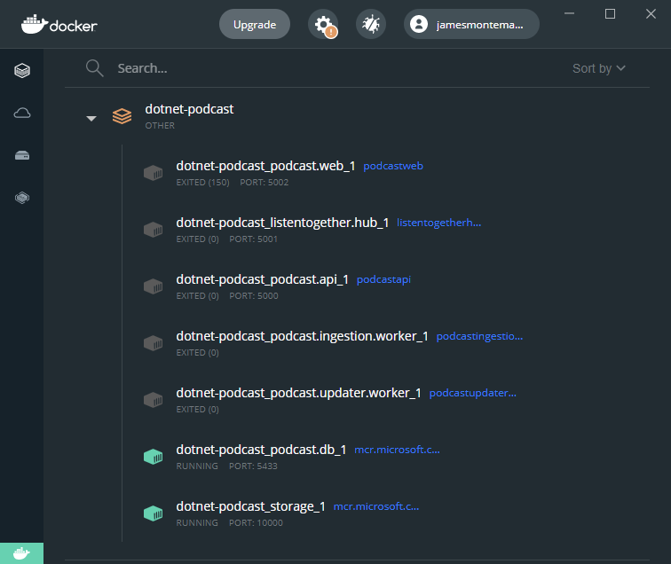

---
Technologies:
- dotnet-core
- ef-core
- blazor
- Maui
- azure-sql-database
- azure-storage
- azure-container-apps
- azure-container-registry
- azure-app-service-web
---

# Maui Podcasts - Sample Application

The .NET Podcast app is a sample application showcasing [.NET 6](https://dotnet.microsoft.com/download/dotnet/6.0), [ASP.NET Core](https://dotnet.microsoft.com/apps/aspnet), [Blazor](https://dotnet.microsoft.com/apps/aspnet/web-apps/blazor), [.NET MAUI](https://dotnet.microsoft.com/apps/maui), [Azure Container Apps](https://azure.microsoft.com/services/container-apps/#overview), , and more.

## Lunch And Learn

- .NET MAUI Application walkthrough for iOS, Android, macOS, and Windows.
- Blazor WebAssembly app walkthough and project structure QA. 
- Walkthough of .NET Core Web APIs & Minimal APIs, ingestion worker, and podcast update worker.
- Azure application walkthough on how to implement a hybrid application of .NET MAUI with Blazor.

## Application Architecture Diagram


## Repositories

For this sample application, we build an app to listen all you favorite .NET podcasts for all the ecosystems: Web, Android, iOS, macOS and Windows. You can find the different apps separated by folders in this repo:

- [Mobile & Desktop:](src/Mobile) Native .NET MAUI Application for iOS, Android, macOS, and Windows
- [Website:](src/Web) Blazor WebAssembly app and ASP.NET Core Razor Marketing website
- [Backend API:](src/Services) ASP.NET Core Web APIs & Minimal APIs, ingestion worker, and podcast update worker
- [Blazor Hybrid App:](src/MobileBlazor) Sample hybrid application of .NET MAUI with Blazor.

## Full Deployment with GitHub Actions

`dotnet-podcasts` repo is configured to deploy all services and websites automatically to Azure using GitHub Actions. [Follow the detailed guidelines](Deploy-websites-services.md) to setup GitHub Actions on your fork.

## Local Deployment Quickstart

The easiest way to get started is to build and run the .NET Podcasts app service, database, and storage using Docker. 

1. First install [Docker Desktop](https://www.docker.com/products/docker-desktop)
2. Clone the repository and navigate to the root directory in a terminal
3. Run the following docker command (this may take some time to pull images, build, and deploy locally)

```cli
docker-compose up
```

This will deploy and start all services required to run the web, mobile, and desktop apps. The Web API will run on `localhost:5000` and the SignalR Hub for listen together will run on `localhost:5001`.

### Web, Mobile, & Desktop

The apps are configured to speak to `localhost` on the correct ports for each service. Simply open the [Web solution](src/Web#solution) or the [.NET MAUI solution](src/Mobile) and run the app.

Ensure that you have the following services running in Docker (podcast.api, listentogether.hub, podcast.updater.worker, podcast.db, storage):


### Backend Services

Open the [Services solution](src/Services) and pick a service to run locally such as the `Podcast.API`.

Ensure that the following services are running in Docker, note that you only need the `podcast.db` and `storage`:



## Local Deployment with Visual Studio

1. First install [Docker Desktop](https://www.docker.com/products/docker-desktop)
2. Clone the repository and navigate to the root directory in a terminal
3. Open the solution `NetPodcast.sln`, set the start project to `docker-compose` and hit F5. To optimize debugging while running all services, please refer to [Launch a subset of Compose services documentation.](https://docs.microsoft.com/visualstudio/containers/launch-profiles)
4. By default, the Podcast.Api's swagger endpoint will be launched. Navigate to `localhost:5002` for the web application. If you see any errors, wait for a while and refresh the page.